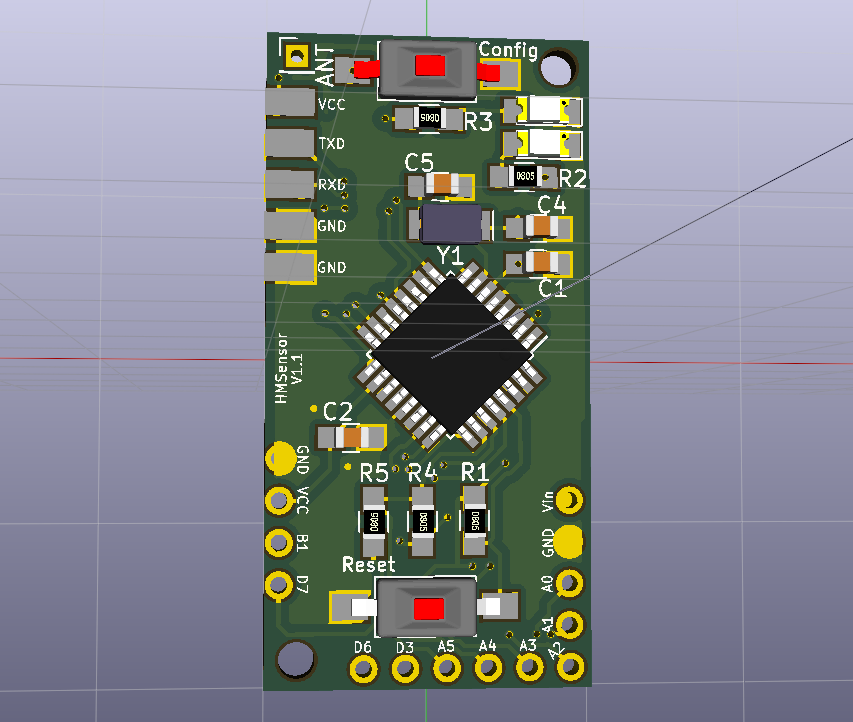
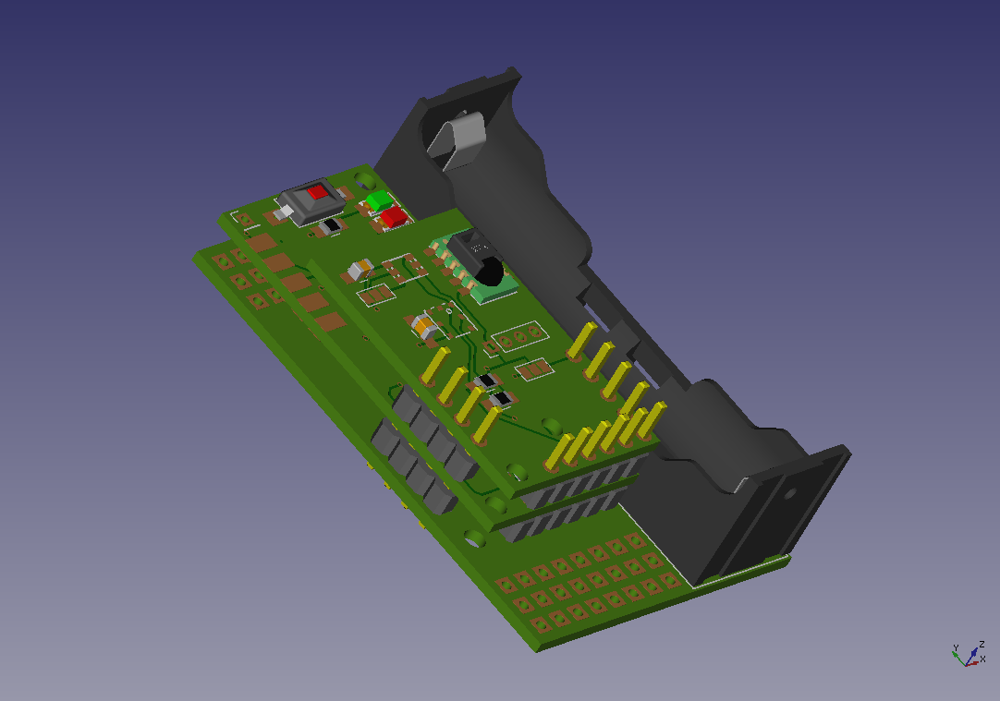

# HMSensor

Flexible and tiny (40x20mm) Hardware Platform for 868MHz Sensors and Actors.

It comes in tow different variants:
* StepUp: For Batter or PowerSupply usage
* CR2032: For even smaller coin battery applications

Extensible with [AddOn-Boards](AddOns).

Some (german) documentation is available at https://asksinpp.de/Projekte/psi/HMSensor
